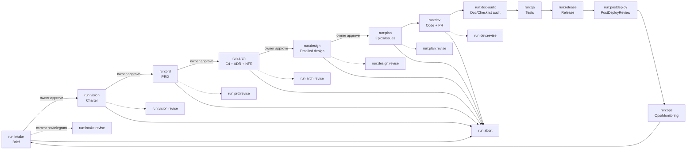

# AI‑компания на базе CodeXCTL: план проработки процессов, ролей, артефактов, MCP, БД и GitHub Workflows

## 0) Цель

План проработки направлен на то, чтобы “бюрократию” (принятие решений, архитектура, согласования, артефакты, связь документов с задачами) автоматизировать и сделать управляемой на уровне разработки/дебага/ремонта инфраструктуры через CodeXCTL и агентов, **с обязательным апрувом владельца продукта на каждом артефакте и на каждом переходе этапа**.

---

## 1) Неподвижные правила (рамка проработки)

1. **CR (Code Reviewer) нет.** Код‑ревью выполняет владелец продукта. Дополнительно допускаются:

    * статические проверки в CI (автоматически),
    * отдельный агент‑аудитор (по запуску) для проверки соответствия кода документам/чек‑листам.

2. Формат описания ролей: после строки `*агент*` — пустая строка перед `Обязанности:` (и вообще `*агент*` отдельной строкой).

3. **Лейблы агентами ставятся только через MCP**, с разделением правил:

    * trigger/deploy‑лейблы (`run:*` и любые лейблы, запускающие агентные воркфлоу или деплой) — только через апрув владельца продукта;
    * семантические и служебные лейблы, которые не запускают агентные воркфлоу или деплой, агент может ставить автоматически по политике проекта.

4. В **PostgreSQL** храним:

    * JSON‑сессии агентов,
    * идентификаторы агентов,
    * учёт токенов/стоимости,
    * историю flow‑событий (создание issue/PR/лейблов/комментариев и т.д.).

   **Всё это делается через MCP**, чтобы учёт был точный и единообразный.

5. **DocSet‑агент** обновляет docset **не напрямую**, а также через MCP (то есть операции “создать/обновить docset, связи, индексы” — это MCP‑инструменты с логированием и апрувом там, где нужно).

6. По БД: **вариант A** — единый PostgreSQL + **pgvector** (векторное хранение внутри Postgres).

7. Учитываем **telegram-executor**: агент может запросить действие/фидбек; поддерживается “feedback‑config”: вопрос + 2–5 кнопок + “свой вариант” (голос/STT или текст). Встраиваем это в этапы, где нужны решения/уточнения.

8. Все лейблы документируем с комментариями вида:
   `* run:intake — старт “идея/проект”`

9. Маппинг текущих лейблов project-example **не нужен** — сразу описываем, что переименовать/исправить.

10. Reusable workflows уже перенесены — требуется доработка: **лейблы брать из `vars.*`**, а не из строк (например: `if: github.event.label.name == vars.RUN_INTAKE_LABEL`).

11. Описываем, **каких агентов запускаем в namespace с полным окружением**, а каких “только с кодом”; и **какие права** (логи/деплойменты/метрики/данные/секреты) выдаём каждому (под RBAC проекта).

---

## 2) Базовый контекст текущей платформы (от чего отталкиваемся)

* CodeXCTL (`codexctl`) — оркестратор поверх `kubectl`/шаблонов/CI: управляет окружениями и AI‑слотами из одного `services.yaml`, создаёт изолированные namespace‑слоты под Issue/PR и запускает Codex‑агента “рядом со стеком” (сервисами, БД, логами, метриками). ([GitHub][1])
* В примере проекта (`project-example`) уже описаны AI‑флоу планирования и разработки (планирование по лейблу, ревизия по комментарию; dev‑флоу по лейблу; repair‑флоу; PR fix по review). ([GitHub][2])
* `yaml-mcp-server` — единый MCP‑gateway: YAML‑DSL описывает инструменты, есть цепочки апруверов (limits → shell → HTTP), идемпотентность, строгий контракт ответа. ([GitHub][3])
* `telegram-approver` — HTTP‑сервис‑апрувер для yaml-mcp-server: отправляет запросы в Telegram и возвращает решение асинхронно callback’ом; есть approve/deny кнопки, optional голос/STT. ([GitHub][4])

---

## 3) Минимальные “штатные единицы” (агенты) для бюрократии и правильной разработки

Ниже — **минимальный** состав, который закрывает “как в большой компании”, но без лишней сложности. Разработку/ремонт инфраструктуры покрывают текущие dev/infra промпты; здесь фокус на **решениях, документах и согласованиях**.

### Owner (Владелец продукта и финальный апрувер)

*человек*

**Обязанности:**

* Принимаете **каждый артефакт** (документ/ADR/PRD/архитектуру/план/релиз‑план).
* Даёте комментарии (GitHub/Telegram), запускаете revision‑циклы.
* Апрувите действия MCP (лейблы, запуск агентов агентами, потенциально опасные операции).

---

### PM/BA (Product Manager + Business Analyst / Продукт + аналитика)

*агент*

**Обязанности:**

* Превращает “идею” в формализованный **Project Brief / Feature Brief**.
* Формирует **PRD**, цели, метрики успеха, scope, ограничения, риски.
* Ведёт “обвязку справа”: сбор обратной связи (прод‑метрики/инциденты/фидбек) → формирование задач на доработку.

---

### SA (Solution Architect / Архитектор решения)

*агент*

**Обязанности:**

* Формирует **архитектурный контур** (C4 L1–L2), интеграции, контракты на уровне системы.
* Ведёт **ADR** (Architecture Decision Records) — решения с аргументацией и последствиями.
* Определяет NFR: надежность, безопасность, производительность, наблюдаемость, масштабирование.

---

### EM (Engineering Manager / Delivery Manager / Менеджер исполнения)

*агент*

**Обязанности:**

* Делает **план поставки**: декомпозиция на эпики/фичи/issue, зависимости, дорожная карта.
* Оркестрирует процессы: какие артефакты на каком этапе обязательны, кто их делает, какие воркфлоу запускать.
* Следит за “Definition of Ready / Definition of Done” (чек‑листы).

---

### QA Lead (Руководитель тестирования)

*агент*

**Обязанности:**

* Готовит **Test Strategy** (что, как и чем тестируем), **acceptance criteria**.
* Формирует набор тест‑артефактов: тест‑кейсы, чек‑листы, регресс‑матрица.
* Участвует в релизе и post‑deploy review вместе с SRE.

---

### SRE/OPS (Site Reliability Engineer / Эксплуатация и надежность)

*агент*

**Обязанности:**

* Готовит **Runbooks**, SLO/SLI, мониторинг/алерты, план инцидентов.
* Участвует в **PostDeployReview** и формирует задачи по улучшению надежности/наблюдаемости.
* Правит инфраструктурные моменты в рамках RBAC и апрувов.

---

### DocSet/KM (Knowledge Manager / Менеджер знаний и связей)

*агент*

**Обязанности:**

* Поддерживает “тонкую” документацию: **DocSet**, индексы, связи Issue/PR ↔ документы.
* Обеспечивает, что документы не разрастаются: дробление на части, единый TOC, единые шаблоны.
* Инициирует индексирование в pgvector (через MCP/KB API).

> Важно: DocSet‑операции выполняются **через MCP** (правило #5).

---

### Auditor (Doc/Checklist Auditor / Аудитор соответствия)

*агент*

**Обязанности:**

* Не делает код‑ревью вместо вас.
* Делает **предварительный аудит** PR/ветки:

    * “соответствует ли реализация документам/ADR/PRD/чек‑листам?”
    * “не забыты ли обязательные артефакты (миграции, метрики, алерты, тест‑план, обновление docset)?”
* Возвращает отчёт и предложения исправлений.

---

## 4) Где живут агенты и как они запускаются

### 4.1. Модель окружений (Kubernetes)

Ориентируемся на то, как `codexctl` задуман: для каждого Issue/PR поднимается изолированный namespace‑слот с тем же стеком, и агент работает “как разработчик рядом со стеком”: запросы к сервисам, логи/события, метрики, PostgreSQL/Redis, apply через декларативные манифесты. ([GitHub][1])

### 4.2. Раннеры GitHub Actions в Kubernetes

`project-example` описывает in‑cluster runner’ы (ARC), манифесты RBAC, и образ runner’а, содержащий `kubectl`, `gh`, `git`, `kaniko`, `go`, `codexctl`. ([GitHub][2])

### 4.3. MCP и Telegram

* `yaml-mcp-server` даёт YAML‑DSL инструменты, цепочки апруверов, идемпотентность, timeouts, строгий контракт ответа. ([GitHub][3])
* `telegram-approver` — асинхронный апрувер с callback обратно в yaml-mcp-server, поддерживает кнопки и голос/STT; `callback.url` обязателен. ([GitHub][4])
* `telegram-executor`: используем для **фидбека/уточнений** (кнопки + свой вариант), и как фронтенд для апрув‑действий.

---

## 5) Хранилища и память

### 5.1. Источник истины

**Git репозиторий (docs/ + код)** — единственный source of truth для документов и решений.

Postgres/pgvector — **индекс/метаданные/аудит**, но не “единственное место документов”.

### 5.2. PostgreSQL + pgvector (вариант A)

В одном Postgres:

* **Реляционные данные**: сущности, связи, статусы, аудит, токены.
* **Векторные эмбеддинги**: `pgvector` для поиска по документам/решениям.

### 5.3. Что именно пишем в Postgres (обязательно)

1. **agent_sessions**

* `session_id`, `agent_id`, `role`, `repo`, `issue_id/pr_id`, `workflow_run_id`, `env/namespace`, timestamps, status
* `session_json` (JSONB) — “сырой лог” (пакеты сообщений, шаги, tool‑calls, итоги)

2. **token_usage**

* `session_id`, `model`, `prompt_tokens`, `completion_tokens`, `total_tokens`, `cost_usd` (если считаете), timestamps

3. **flow_events**

* “история процесса”: создание issue/PR, навешивание/снятие лейбла, комментарии, апрувы/денаи, мердж PR, релизы
* Каждое событие: `correlation_id`, actor (agent/human/system), payload JSONB

4. **docs_meta**

* `doc_id`, `path`, `title`, `type`, `status`, `owner_role`, `version`, `hash`, `updated_at`

5. **doc_chunks**

* `doc_id`, `chunk_id`, `chunk_text`, `embedding vector`, `metadata JSONB` (section, headings, etc.)

6. **links**

* связи: `issue_id ↔ doc_id`, `pr_id ↔ doc_id`, `adr_id ↔ decision`, `service ↔ doc_id`, т.д.

> Ключевое: записи делаются **через MCP** (правило #4). Это значит, что любые действия, которые важны для аудита/учёта, должны иметь MCP‑обёртку или MCP‑логирование.

---

## 6) Документы: как хранить, чтобы не раздувались, и как связывать с GitHub

### 6.1. Принцип “много маленьких документов”

Вместо одного гигантского PRD/архитектуры:

* **один документ = одна цель** (brief / ADR / use case / контракт / runbook / тест‑план)
* крупные темы — это **директории** + index.md (TOC)

### 6.2. Обязательная мета‑шапка (front‑matter) в каждом документе

Каждый документ в `docs/**` начинается с фронт‑маттера (YAML), например:

* `doc_id`
* `type` (brief/prd/adr/design/runbook/test-plan/…)
* `status` (draft/approved/superseded/obsolete)
* `owner_role`
* `related_issues`, `related_prs`
* `supersedes`/`superseded_by` (для откатов/переосмыслений)

### 6.3. DocSet как “контейнер связей” для Issue/PR

**DocSet** — YAML/MD файл, который описывает:

* какой Issue/PR к чему относится,
* список `doc_id` + пути,
* какие артефакты уже approved,
* какие обязательны, но отсутствуют.

Пример размещения:

* `docs/_docset/issues/issue-123.yaml`
* `docs/_docset/prs/pr-456.yaml`

**DocSet/KM‑агент** обновляет это **через MCP** (правило #5), а MCP:

* логирует изменение в Postgres,
* (опционально) создаёт PR/коммит с изменениями docset‑файлов.

### 6.4. Связь GitHub ↔ Документы (автоматически)

Правила:

* Любой `run:*` workflow:

    1. гарантирует наличие docset для issue,
    2. добавляет/обновляет связи `issue ↔ doc_id` через MCP,
    3. при создании PR добавляет link на docset и список артефактов в описание PR,
    4. синхронизирует `Issue ↔ Docs Map` (issue_map) для трассируемости.

---

## 7) MCP‑слой: какие инструменты нужны (и где апрувы)

### 7.1. Почему MCP — обязательный слой

`yaml-mcp-server` создан именно для безопасных действий: YAML‑инструменты + цепочка апруверов + строгий контракт ответа. ([GitHub][3])
В нём же уже показан паттерн “секреты/БД без раскрытия секретов модели”: модель передает только имена секретов, инструмент читает секреты из k8s и делает DB‑операцию. ([GitHub][3])

### 7.2. Категории MCP‑инструментов

#### A) GitHub инструменты (пишущие с политикой апрува)

* `github_request_label` (поставить/снять лейбл):
  * для trigger/deploy‑лейблов — **только с апрувом владельца продукта**;
  * для семантических и не-триггерных лейблов — по политике автоматической постановки через MCP.
* `github_create_issue`, `github_create_pr`, `github_comment`, `github_request_review`, `github_merge_pr` — через MCP (уровень апрува определяется политикой этапа).
* `github_set_milestone`, `github_add_to_project`, `github_close_issue` и т.п.

#### B) KB инструменты (Postgres)

* `kb_session_start`, `kb_session_end`
* `kb_token_usage_append`
* `kb_flow_event_append`
* `kb_doc_upsert_meta`
* `kb_doc_index_chunks` (создать эмбеддинги и положить в pgvector)
* `kb_link_issue_doc`, `kb_link_pr_doc`

#### C) DocSet инструменты

* `docset_sync_issue` (создать/обновить docset issue)
* `docset_sync_pr`
* `docset_sync_issue_map` (обновить matrix traceability `Issue/PR ↔ docs ↔ release`)
* `docset_validate_required_artifacts`

> DocSet‑агент делает это через MCP (правило #5).

#### D) Kubernetes инструменты (опасные — с апрувом)

* чтение: `k8s_get_logs`, `k8s_get_events`, `k8s_get_rollout_status`, `k8s_get_metrics`
* запись: `k8s_apply_manifest`, `k8s_patch_deployment`, `k8s_restart_rollout`, `k8s_scale`, etc. (через апрув)
* секреты и БД: используем готовые паттерны из yaml-mcp-server: создание GitHub secret + injection в k8s; создание Postgres DB по секретам. ([GitHub][3])

#### E) Telegram инструменты

* **апрувы**: через `telegram-approver` (approve/deny/voice). ([GitHub][4])
* **вопросы/решения**: через `telegram-executor` “feedback‑config”:

    * вопрос,
    * 2–5 кнопок,
    * “свой вариант” (голос/STT или текст),
    * результат пишется в Postgres и в GitHub как комментарий/decision record.

### 7.3. “Жёсткое” правило при нехватке данных

Если агенту не хватает входных данных/неоднозначность блокирует решение:

* агент **останавливается**,
* формирует “Request for Input” через telegram-executor (с кнопками вариантов),
* параллельно **через MCP запрашивает** постановку лейбла `need:input` (и/или `need:<role>`),
* дальше продолжение только после ответа/апрува владельца продукта.

---

## 8) Лейблы (новая система, без маппинга на старые)

### 8.1. Trigger‑лейблы `run:*` (запускают воркфлоу)

* `run:intake` — старт “идея/проект”: сформировать intake-пакет (Problem Statement, Personas, MVP Scope, Constraints, Brief, начальный DocSet)
* `run:intake:revise` — доработка intake по комментариям/ответам владельца продукта
* `run:vision` — сформировать Vision/Scope (Project Charter) + Success Metrics + Risk Register
* `run:vision:revise` — доработка Vision/Scope
* `run:prd` — сформировать PRD/требования
* `run:prd:revise` — доработка PRD
* `run:arch` — сформировать Architecture Overview (C4 Context/Container) + Alternatives + ADR backlog + NFR
* `run:arch:revise` — доработка архитектуры/ADR
* `run:design` — сформировать Detailed Design + API Contract + Data Model + Migrations Policy
* `run:design:revise` — доработка detailed design
* `run:plan` — сформировать Delivery Plan: epic/story/dependencies/milestones + Definition of Done + roadmap-срез + связи с docset
* `run:plan:revise` — доработка плана
* `run:dev` — разработка (код) по issue (аналог текущего dev‑флоу, но в новой схеме) ([GitHub][2])
* `run:dev:revise` — доработка кода по комментариям владельца продукта (не вместо code review)
* `run:doc-audit` — аудит соответствия (документы/чек‑листы ↔ код) + обновление Issue Map
* `run:qa` — подготовить/обновить Test Strategy/Test Plan/Test Matrix/Regression Checklist + прогон тестов
* `run:release` — релиз (подготовка + выполнение): Release Plan + Rollback Plan + Release Notes
* `run:postdeploy` — PostDeployReview (QA+SRE) и, при инциденте, Incident Postmortem
* `run:ops` — эксплуатация/мониторинг: Monitoring/SLO/Alerts/Runbook/Incident Playbook + улучшения
* `run:abort` — отмена/откат текущей инициативы/фичи (cleanup + пометка артефактов)
* `run:rethink` — переосмысление: перевести работу на более ранний этап (создать новую ветку документов/версии)

### 8.2. Служебные лейблы `state:*`

* `state:blocked` — работа заблокирована входными данными/апрувом
* `state:in-review` — артефакт на ревью владельца продукта
* `state:approved` — артефакт принят
* `state:superseded` — артефакт заменён более новым
* `state:abandoned` — задача/инициатива отменена

### 8.3. Лейблы потребностей `need:*`

* `need:input` — нужен ответ/данные от владельца продукта
* `need:pm` — нужен PM/BA агент (уточнения требований/метрик)
* `need:sa` — нужен SA агент (архитектурные уточнения)
* `need:qa` — нужен QA агент
* `need:sre` — нужен SRE агент

### 8.4. Семантические и конфигурационные лейблы (из `README_RU.md`)

Семантические лейблы (добавляют и агенты, и люди):

* `feature` — задача на новую функциональность продукта.
* `bug` — задача на исправление дефекта в существующем поведении.
* `doc` — задача на создание или актуализацию документации.
* `debt` — задача на погашение технического долга (рефакторинг, выравнивание стандартов, обновления зависимостей).
* `idea` — задача на проработку гипотезы или исследование решения до фиксации в плане реализации.
* `epic` — крупная инициатива, объединяющая набор связанных задач.

Конфигурационные лейблы модели/рассуждений:

* `[ai-model-gpt-5.3-codex]`, `[ai-model-gpt-5.2]`, `[ai-model-gpt-5.1-codex-max]`, `[ai-model-gpt-5.1-codex-mini]`
* `[ai-reasoning-low]`, `[ai-reasoning-medium]`, `[ai-reasoning-high]`, `[ai-reasoning-extra-high]`

### 8.5. Политика постановки лейблов агентами

* Любая постановка лейблов агентом выполняется через MCP (аудит и единообразие).
* Trigger/deploy‑лейблы — только через апрув владельца продукта.
* Семантические и не-триггерные лейблы (state/need/model/reasoning), которые не запускают агентные workflow и не запускают деплой, могут ставиться агентом автоматически по политике проекта.

---

## 9) GitHub Workflows: архитектура и требования

### 9.1. Wrapper + Reusable (как сейчас, но расширяем)

В `project-example` уже описано, что в проекте остаются wrapper‑workflow (только триггеры), а тела reusable‑workflow живут в `codexctl` и подключаются через `uses: codex-k8s/codexctl/.github/workflows/<name>@<ref>`. ([GitHub][2])

**Требование:** сохранить эту архитектуру, но:

* переименовать воркфлоу/лейблы под новую систему,
* добавить поддержку `vars.*` для лейблов (правило #10),
* встроить MCP‑логирование (сессии/токены/flow events),
* встроить Telegram‑апрувы/фидбек для промежуточных решений.

### 9.2. Переменные репозитория/организации (labels-as-vars)

В GitHub Variables (repo/org) задаём:

* `RUN_INTAKE_LABEL="run:intake"`
* `RUN_INTAKE_REVISE_LABEL="run:intake:revise"`
* `RUN_VISION_LABEL="run:vision"`
* … (аналогично для всех `run:*`)
* (опционально) `NEED_INPUT_LABEL="need:input"`, `STATE_IN_REVIEW_LABEL="state:in-review"`, и т.д.

И в workflow условия задаются в целевом виде:

* не `== "run:intake"`,
* а `== vars.RUN_INTAKE_LABEL`.

---

## 10) Таблица воркфлоу (лейбл → кто/когда → вход/выход → апрувы → откат)

> Принцип: **каждый этап создаёт артефакты → отправляет их на ревью владельцу продукта → по комментариям запускается revise → после “approved” запрашивается апрув перехода на следующий этап (через Telegram) → MCP ставит следующий `run:*`**.

| Лейбл               | Workflow (название)       | Кто/когда запускает                       | Артефакты на входе                   | Артефакты на выходе                                                               |
| ------------------- | ------------------------- | ----------------------------------------- | ------------------------------------ | --------------------------------------------------------------------------------- |
| `run:intake`        | `wf_intake_draft`         | Owner (вешает лейбл на issue “идея/проект”) | Issue (описание идеи), контекст репо | Problem Statement + Personas + MVP Scope + Constraints + Brief + список вопросов + начальный docset |
| `run:intake:revise` | `wf_intake_revise`        | Owner (после комментариев/ответов)          | Intake-пакет v1 + ответы (Telegram/GH) | Intake-пакет v2, обновлённый docset                                             |
| `run:vision`        | `wf_vision_draft`         | Owner / через Telegram approve “Proceed”    | Approved intake-пакет                | Project Charter + Success Metrics + Risk Register + docset                         |
| `run:vision:revise` | `wf_vision_revise`        | Owner                                       | Vision draft + комменты              | Vision v2                                                                         |
| `run:prd`           | `wf_prd_draft`            | Owner                                       | Approved Vision/Intake               | PRD (MVP/Scope/NFR/AC), backlog гипотез, актуализация связей с personas/scope      |
| `run:prd:revise`    | `wf_prd_revise`           | Owner                                       | PRD draft + комменты                 | PRD v2                                                                            |
| `run:arch`          | `wf_arch_draft`           | Owner                                       | Approved PRD + constraints           | Architecture Overview (C4 Context/Container) + Alternatives + ADR backlog + NFR    |
| `run:arch:revise`   | `wf_arch_revise`          | Owner                                       | Arch draft + комменты                | Arch v2 + обновлённые ADR/Alternatives                                            |
| `run:design`        | `wf_design_draft`         | Owner                                       | Approved Arch/ADR list               | Design Doc + API Contract + Data Model + Migrations Policy + sequence/test design  |
| `run:design:revise` | `wf_design_revise`        | Owner                                       | Design draft + комменты              | Design v2                                                                         |
| `run:plan`          | `wf_delivery_plan_draft`  | Owner                                       | Approved Design + constraints        | Delivery Plan + Epic/User Story пакет + Definition of Done + roadmap-срез + docset links |
| `run:plan:revise`   | `wf_delivery_plan_revise` | Owner                                       | Plan draft + комменты                | Plan v2 + обновлённые story/epic/roadmap                                          |
| `run:dev`           | `wf_dev_issue`            | Owner (на конкретном issue фичи/таски)      | Approved Plan + design refs          | PR с кодом, обновлённые docs/ADR (если нужно), запись сессии/токенов              |
| `run:dev:revise`    | `wf_dev_revise`           | Owner                                       | PR comments/Telegram feedback        | Доп. коммиты в PR                                                                 |
| `run:doc-audit`     | `wf_doc_audit`            | Owner (обычно перед merge)                  | PR + docset + чек‑листы              | Отчёт аудита (comment + docs) + обновлённый Issue Map                              |
| `run:qa`            | `wf_qa`                   | Owner / по готовности PR                    | PR + PRD/AC + test design            | Test Strategy + Test Plan + Test Matrix + Regression Checklist + результаты прогонов |
| `run:release`       | `wf_release`              | Owner (после merge)                         | merged main + release readiness      | Release Plan + Rollback Plan + Release Notes + tag/release + запись событий        |
| `run:postdeploy`    | `wf_postdeploy_review`    | Owner (после релиза)                        | релиз, метрики/логи                  | PostDeployReview doc + Incident Postmortem (если был инцидент) + action items      |
| `run:ops`           | `wf_ops_improvements`     | Owner / периодически                        | PostDeploy/инциденты                 | Monitoring + SLO + Alerts + Runbook + Incident Playbook + новые issue              |
| `run:abort`         | `wf_abort_cleanup`        | Owner (в любой момент)                      | текущий статус + docset              | cleanup слотов/PR статусов, docs помечены abandoned/superseded                    |
| `run:rethink`       | `wf_rethink`              | Owner                                       | текущие docs + решение владельца     | новая итерация документов (новые версии + связи), старые помечены superseded      |

**Где апрувы/фидбек:**

* На каждом `*_draft` воркфлоу:

    1. агент генерирует артефакт(ы) (обычно PR в docs),
    2. отправляет в Telegram владельцу продукта через executor: **Approve / Request changes / Abort / Ask** (кнопки),
    3. действие фиксируется в Postgres (flow_event),
    4. по “Request changes” запускается `run:*:revise` (вручную владельцем продукта или автоматически через telegram-executor с апрувом, если это агент‑инициировано).

**Откат на каждом этапе:**

* Всегда доступен `run:abort` (и/или `run:rethink`), который:

    * закрывает/помечает работу,
    * убирает активные `run:*`,
    * помечает документы `abandoned` / `superseded`,
    * очищает окружения/слоты,
    * фиксирует событие в Postgres.

---

## 11) End‑to‑End процесс (от идеи до эксплуатации + обратная связь)

### 11.1. Mermaid‑диаграмма процесса (с апрув‑петлями)

### 11.2. Пошагово словами (по этапам и артефактам)

1. **Intake (идея/проект)** — `run:intake`
   Артефакты:

    * Problem Statement
    * Personas
    * MVP Scope
    * Constraints
    * Brief (что делаем, зачем, для кого, ограничения)
    * Список вопросов (если не хватает данных)
    * DocSet issue

   Если данных не хватает → telegram-executor: вопрос с вариантами → `need:input` → revise.

2. **Vision/Scope** — `run:vision`
   Артефакты:

    * Project Charter (цели, scope, out-of-scope)
    * Success Metrics
    * Risk Register
    * Риски, допущения, обновление docset

3. **PRD** — `run:prd`
   Артефакты:

    * PRD (MVP, use-cases, acceptance criteria, NFR черновик)
    * Список будущих ADR (что надо решить архитектурно)

4. **Architecture** — `run:arch`
   Артефакты:

    * Architecture Overview (C4 Context + C4 Container)
    * Alternatives & Trade-offs
    * ADR backlog (и/или первые ADR)
    * NFR: reliability, security, performance, observability

5. **Detailed Design** — `run:design`
   Артефакты:

    * Detailed Design
    * API Contract
    * Data Model
    * DB Migrations Policy
    * Sequence diagrams по ключевым сценариям
    * Test design (что тестируем, где границы)

6. **Delivery Plan** — `run:plan`
   Артефакты:

    * Delivery Plan
    * Epic + User Story пакет
    * Definition of Done
    * Roadmap (итерационный срез под поставку)
    * Epics/issues, dependencies, milestones
    * DocSet привязки: “какие issue используют какие docs”

7. **Development** — `run:dev`
   Ориентир на текущую механику: поднятие слота, запуск агента, PR ветка и коммиты. ([GitHub][2])
   Артефакты:

    * PR с кодом
    * Обновление docs/ADR (если решение поменялось)
    * Логи сессии, токены, flow events в Postgres (через MCP)

8. **Doc/Checklist Audit** — `run:doc-audit`
   Артефакты:

    * отчёт “что не соответствует / что забыли / что рискованно”
    * актуализированный Issue ↔ Docs Map

9. **QA** — `run:qa`
   Артефакты:

    * Test Strategy
    * Test Plan
    * Test Matrix
    * Regression Checklist
    * результаты прогонов (artifact/report)

10. **Release** — `run:release`
    Артефакты:

    * Release Plan + Rollback Plan + Release Notes
    * changelog + tag/release
    * события в Postgres (кто, когда, что релизнул)

11. **PostDeployReview** — `run:postdeploy`
    Артефакты:

    * PostDeployReview doc (что увидели QA+SRE, метрики, регрессии, инциденты)
    * Incident Postmortem (если в релизном окне был инцидент)

12. **Ops/Monitoring + Feedback loop** — `run:ops`
    Артефакты:

    * Monitoring & Observability doc
    * SLO + Alerts
    * Runbook + Incident Playbook
    * обновления Risk Register / Roadmap по итогам эксплуатации
    * новые issue (инициируются EM/PM агентом через MCP + апрув)

---

## 12) Кто в окружении, а кто “только с кодом” (и какие права)

Базовый вариант проработки: **всех агентов запускать в k8s‑слоте**, чтобы:

* любой агент мог при необходимости посмотреть логи/состояние сервисов,
* исключить ситуацию “документ написан без проверки реальности”.

Но права — разные.

### 12.1. Режимы запуска

**Режим 1: Full‑env (namespace‑slot + доступ к сервисам/логам/метрикам)**
Подходит для: SA, EM, QA, SRE, Dev, Auditor, DocSet.

**Режим 2: Code‑only (репо без доступа к k8s)**
Подходит для: PM/BA (часто достаточно), DocSet (иногда), но может не использоваться в режиме full-env по умолчанию.

### 12.2. RBAC‑матрица (ориентир)

| Роль       | K8s чтение (pods/logs/events/services/ingress) |                        K8s запись (apply/patch/rollout) | Доступ к метрикам |                         Доступ к БД (данные) |       Доступ к secret |
| ---------- | ---------------------------------------------: | ------------------------------------------------------: | ----------------: | -------------------------------------------: | --------------------: |
| PM/BA      |                                 опц. read-only |                                                     нет |    опц. read-only |                                          нет |                   нет |
| SA         |                                      read-only |                             нет (или только в dev-slot) |         read-only | read-only (schema/миграции), без прод‑данных |                   нет |
| EM         |                                      read-only | ограниченно (создание dev-slot ресурсов через codexctl) |         read-only |                                          нет |                   нет |
| QA Lead    |                                      read-only |                        ограниченно (запуск тест job’ов) |         read-only |                  read-only (тестовые данные) |                   нет |
| SRE/OPS    |                                      read-only |                            **да, но через MCP approve** |        read/write |                  read-only (для диагностики) | через MCP инструменты |
| Dev agents |                                      read-only |                    да (dev-slot), через процессы/апрувы |         read-only |               read/write (dev/test), не prod |       нет (через MCP) |
| DocSet/KM  |                                    нет/минимум |                                                     нет |               нет |                              да (meta+links) |                   нет |
| Auditor    |                                      read-only |                                                     нет |         read-only |                                          нет |                   нет |

**Как это стыкуется с тем, что уже есть:**

* В `project-example` есть базовые RBAC манифесты для runner’ов и слотов (например `rbac-ai-base.yaml`, `rbac-ai-slots.yaml`). ([GitHub][2])
* В плане проработки это расширяется до “нескольких service accounts” (или нескольких Role/RoleBinding) с выбором SA по роли агента.

---

## 13) Требования к изменению репозиториев и системы (без реализации кода)

### 13.1. `codexctl` (оркестратор)

1. **Reusable workflows**

    * Переименовать/добавить reusable workflows под новую схему этапов (intake/vision/prd/arch/design/plan/dev/qa/release/postdeploy/ops/abort/rethink).
    * Встроить в них “обвязку”:

        * `kb_session_start/end`
        * `kb_flow_event_append`
        * сбор “session JSON” и запись в Postgres (через MCP/KB API).

2. **Поддержка label‑vars**

    * В wrapper‑workflow проектного репо сравнение лейблов делаем через `vars.*` (правило #10).
    * Аналогично — если в reusable workflow есть логика лейблов/состояний.

3. **Шаблоны манифестов для KB/DB**

    * Добавить в `codexctl` готовые шаблоны:

        * `kb-postgres` (StatefulSet/Service/PVC) **или** конфиг для подключения к существующему Postgres,
        * `kb-api` (Go‑сервис, Deployment/Service/Ingress),
        * миграции/инициализация `pgvector` (init job / migration step).
    * Важно: эти шаблоны должны быть **опциональны** и переопределяемы из `services.yaml`.

4. **`services.yaml` как слой переопределений**

    * Добавить секцию, где пользователь:

        * включает/выключает KB слой,
        * выбирает: “использовать встроенные манифесты” или “свой Postgres/свой ingress/свой storageclass”,
        * задаёт connection info (через секреты).

`codexctl` концептуально уже строится вокруг одного `services.yaml`, который описывает infra/services/environments/codex pod. ([GitHub][1])

---

### 13.2. Project repo (типа `project-example`)

1. **Новый набор labels**

    * Завести labels, описанные в разделе 8.
    * Старые триггеры заменить (без маппинга; просто “переключаемся”).

2. **Wrapper workflows**

    * В `.github/workflows/*.yml` оставить только thin wrappers, которые вызывают reusable workflow из `codexctl`. ([GitHub][2])
    * Условия триггера — через `vars.RUN_*`.

3. **Issue templates**

    * Шаблон “Project Intake”
    * Шаблон “Feature/Task”
    * Каждый шаблон включает обязательные поля, чтобы агентам не пришлось угадывать.

4. **Docs структура**

    * Завести `docs/_docset/**`
    * Завести `docs/templates/**` (включая product/arch/qa/release/ops шаблоны: problem, personas, scope, constraints, alternatives, risks, roadmap, story, dod, migrations-policy, monitoring, rollback, incident-playbook, incident-postmortem, issue-map)
    * Завести `docs/_index/**` (TOC)

5. **CI prechecks (без агента)**

    * авто‑workflow на PR: lint/test/static checks.

---

### 13.3. `yaml-mcp-server` + конфиги

1. Использовать embedded configs как базу (они уже упомянуты в README):
   `github_secrets_postgres_k8s.yaml`, `github_review.yaml`. ([GitHub][3])

2. Добавить свои YAML tools:

    * GitHub label request (approve required),
    * KB API calls (sessions/tokens/flow events),
    * DocSet sync tools,
    * Telegram executor tools (если он будет отдельным сервисом — просто HTTP tool).

3. Обязательно:

    * включить/настроить идемпотентность (для повторных вызовов),
    * настроить таймауты на долгие апрувы (`tool_timeout_sec`) на стороне Codex config. ([GitHub][3])

---

### 13.4. `telegram-approver` и `telegram-executor`

**telegram-approver**:

* настроить env vars (token/chat_id/webhook/timeout/STT model) ([GitHub][4])
* обеспечить доступность callback URL до yaml-mcp-server (обязательно, т.к. решения всегда async). ([GitHub][4])

**telegram-executor**:

* добавить операции:

    * “ask question with buttons” (feedback-config),
    * “capture custom answer” (text/voice STT),
    * “emit decision to Postgres + comment to GitHub” (через MCP/KB API),
    * “request label apply” (через MCP, с апрувом владельца продукта для trigger/deploy‑лейблов).

---

## 14) Встраивание Postgres/pgvector и KB‑API (как data‑потоки будут ходить)

### 14.1. Центральный поток записи (agent/session)

1. Workflow стартует → `kb_session_start` (MCP → KB API → Postgres)
2. Агент работает (в слоте)
3. Workflow завершает → собирает session JSON → `kb_session_end`
4. Токены/стоимость → `kb_token_usage_append`
5. Любые GitHub действия (лейблы/PR/комменты), инициированные агентом → через MCP → `flow_events`

### 14.2. Индексация документов

Триггер: merge PR в `main` (docs или code+docs)

* workflow `kb_index_docs`:

    * читает изменённые docs,
    * обновляет `docs_meta`,
    * бьёт на чанки,
    * создаёт embeddings,
    * пишет в `doc_chunks` (pgvector).

### 14.3. Запросы чтения (RAG)

Любой агент на этапе:

* делает MCP‑вызов `kb_search(query, scope=issue/docset)`:

    * получает релевантные куски (doc_chunks),
    * использует их для принятия решения/формирования артефакта,
    * при этом источник истины всё равно Git.

---

## 15) Состав изменений относительно текущих флоу

В `project-example` сейчас описаны триггеры вида `[ai-plan]`, `[ai-dev]`, `[ai-repair]` и связанная логика (plan_issue, plan_review, dev_issue, repair_issue). ([GitHub][2])
В новой схеме:

* **переходим на `run:*`**, как описано выше,
* добавляем обязательные ревизионные `run:*:revise`,
* добавляем DocSet/KM/KB слой и Telegram approvals в каждый этап,
* PR review fix можно оставить как отдельный `run:dev:revise` (по `changes requested`), но запуск остается под контролем владельца продукта (вручную через лейбл или через telegram-executor + MCP request label + approve).

---

## 16) Итог

Итог целевой проработки:

* **Любая работа агента** существует как **workflow** с чётким входом/выходом.
* **Любой артефакт** проходит ревью владельца продукта (в PR или через Telegram‑циклы), и есть `*:revise`.
* **Любое действие агента, влияющее на процесс (trigger/deploy‑лейблы, запуск других агентов)** идёт через MCP с апрувом владельца продукта.
* **Память и аудит** (сессии, токены, flow events, связи issue↔docs) живут в **Postgres+pgvector** и обновляются через MCP.
* Документы не превращаются в монолиты: они дробятся, индексируются, связаны с задачами, и их легко переосмысливать/откатывать через `run:abort`/`run:rethink`.

[1]: https://github.com/codex-k8s/codexctl "GitHub - codex-k8s/codexctl:  A tool for managing cloud planning and development workflows in a Kubernetes cluster through AI agents based on OpenAI's codex-cli and GitHub workflows."
[2]: https://github.com/codex-k8s/project-example "https://github.com/codex-k8s/project-example"
[3]: https://github.com/codex-k8s/yaml-mcp-server "GitHub - codex-k8s/yaml-mcp-server"
[4]: https://github.com/codex-k8s/telegram-approver "GitHub - codex-k8s/telegram-approver"
