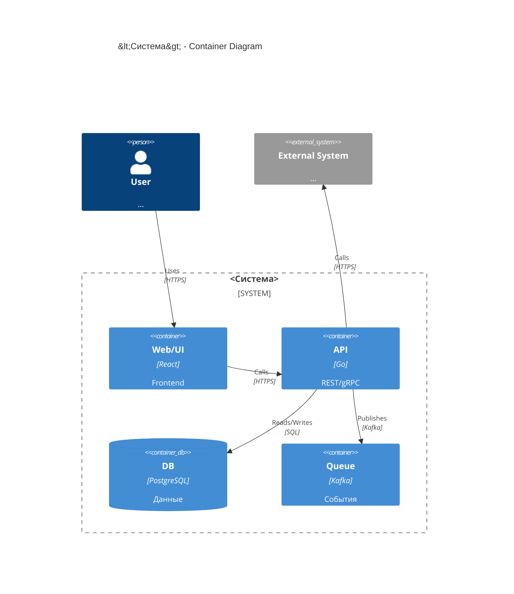

# C4 Container: <Система>

## TL;DR
- Основные контейнеры: ...
- Технологии: ...
- Потоки данных: ...

## Диаграмма (Mermaid C4Container)

## Контейнеры (описание)

### Web/UI

* Ответственность:
* Деплой:
* Риски:

### API

* Ответственность:
* Контракты:
* Ограничения:

### DB

* Схема/миграции:
* Резервирование/бэкап:

### Queue

* Топики:
* Гарантии доставки:

## Открытые вопросы

* ...

## Апрув

* request_id: ...
* Решение:
* Комментарий:
