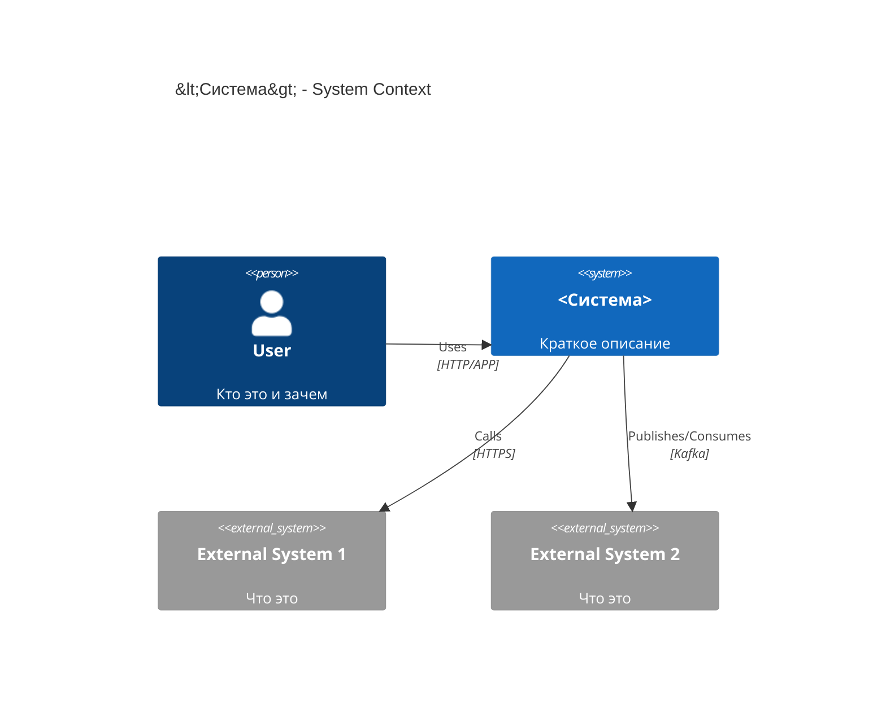

# C4 Context: <Система>

## TL;DR
- Система в контуре: ...
- Пользователи: ...
- Внешние зависимости: ...

## Диаграмма (Mermaid C4Context)

## Пояснения

- Основные взаимодействия:
- Границы ответственности:

## Внешние зависимости

- ext1: SLA/SLO? Риски?
- ext2: ...

## Открытые вопросы

- ...

## Апрув

- request_id: ...
- Решение:
- Комментарий:
